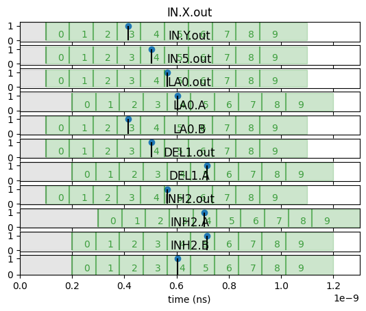

# Assignment: Delay-Based Computing

In this assignment, we will implement numerous delay-based computing gates in `delay_gates.py`. To implement each gate, you need to fill in the `reset` and the `execute` functions:

 - The `reset` function should reset the state of the gate before execution. Recall delay-based computing gates are stateful and "remember" pulse information, and pulses are stored during a loading stage then released during execution. The reset function should define and reset whatever flags are necessary to correctly implement the operation of the gate.
 - The `execute` function should determine if the gate produces a pulse at a given timestep. The execute function takes as input the current time step (in nanoseconds), and a dictionary of input-value pairs. In this implementation, each port may have two values: PULSE (1) or NO_PULSE (0).

A `delay_circuit.py` Python file is provided to simulate a delay-based computing circuit and render the results, and a `delay_tester.py` Python file is provided to construct some simple single-gate circuits and simulate them for you. Each test function in the `delay_tester.py` produces a visualization of each simulation and a visualization of the circuit architecture. The measured time window is shaded.

## Part X: Understanding Delay-Based Encodings [8 points]

Execute the `delay_tester.py` file as is to investigate the behavior of delay-based input over time. The `test_input` function simulates the propagation of three constant delay-based values with labels ('X', 'Y', 'Z') through an empty circuit and outputs a pulse trace (`test_input.png`) and a summary of all the pulse arrivals/departures to console.

1. What does each numbered segment in the input image represent? What does it mean when a pulse (vertical line) is contained within a numbered segment?

It represents a number so there's 10 tiles and 10 numbers 0-9 so whenever we get a pulse within a certain window 0-9, it represents that value.

2. What kind of value does an earlier pulse encode, what kind of value does a later pulse encode?

The earlier pulse encodes a lower value and the later pulse encodes a higher value.

3. Run the simulation multiple times. Do you observe any variations in the plots from execution to execution?

Yea they slightly vary from run to run but so far they've been in the same window but some have been close to the edge of the next window. 

4. Look at the pulse summary printed to console. How is a gate's numerical values computed from the relative delay and segment time? How is the relative delay computed from the absolute delay and the gate's settling time? The settling time for a given port is the time required for the pulse to reach a particular port.

There's a setting time thats taken into account for the first window that would've been there isn't there because with the setting time its not possible for a pulse to land there. Relative delay is computed by subtracting the setting time from the absolute delay.

# Part Y: Implementing the Delay Gates [8 pts]

Next, we will implement the simulations of first arrival, last arrival, delay, and inhibition gates associated with delay-based computing. Each delay gate is reset before execution, and then "executed" at each time step. The reset and execute functions may instantiate and change the gate's internal state, feel free to instantiate any internal variables needed.

1. Implement the reset and execute functions for the first arrival (`FirstArrival`) gate. Describe any internal state maintained by the gate, and what the reset operation and execution functions do for this gate. Uncomment the `test_first_arrival_gate` function in `delay_tester.py` to test the operation of the first arrival gate.

So the state is a bool that tracks if we've outputted a pulse yet and if we've received a pulse yet. The reset function sets these to false and the execute function outputs a pulse if we haven't outputted a pulse yet and we get a second pulse (this implementation assumes we will get a pulse from each input every time window).

2. Implement the reset and execute functions for the last arrival (`LastArrival`) gate. Describe any internal state maintained by the gate, and what the reset operation and execution functions do for this gate. Uncomment the `test_last_arrival_gate` function in `delay_tester.py` to test the operation of the last arrival gate.

So the state is a bool that tracks if we've outputted a pulse yet. The reset function sets that to false and the execute function outputs a pulse upon our first pulse and then doesn't output a pulse again until that reset.

3. Implement the reset and execute functions for the delay (`Delay`) gate. Describe any internal state maintained by the gate, and what the reset operation and execution functions do for this gate. Uncomment the `test_delay_gate` function in `delay_tester.py` to test the operation of the delay gate. What does the circuit described in the `test_delay_gate` function do to the input value? 

The internal state I have is 2 bools that remember if we've received a pulse and the time we should pulse out based off when we received the first pulse in. The reset function sets these to false and the execute function sets the output pulse time to the current time + delay when we received the first pulse in and then outputs a pulse if the current time is at least that summed up value and we haven't pulsed out yet. The circuit in test_delay_gate simply sets up the 1 input delay gate and sets a delay of 1.818e-10 ns and then that is the delay permanent for the gate so any pulse we get in after that will be delayed by that amount.

4. Implement the reset and execute functions for the inhibition (`Inhibition`) gate. If two pulses arrive at the same time (which is unlikely in practice), you can assume that the gate emits a pulse with 50% probability. Describe any internal state maintained by the gate, and what the reset operation and execution functions do for this gate. Uncomment the `test_inh_gate` function in `delay_tester.py` to test the operation of the inhibition gate.

The state is a bool that tracks if we've received pulse A yet. The reset function sets that to false and the execute function outputs a pulse if we haven't received a pulse A yet and we get a pulse B. Otherwise if pulse A arrives before B, we can never output a pulse. It also handles the edge case where we get two pulses at the same time.

# Part Z: Using Delay-Based Computing [6 pts + 6 extra credit]

Implement a circuit that computes the numerical function.

    if max(X,Y) < 5:
        return max(X,Y)
    else:
        <no pulse>

You can use the `add_wire(src_gate,dst_gate,port)` function to add wires between gates, and the `add_gate(gate)` function to add a gate to the circuit. Feel free to use the `render_circuit("filename")` function to visualize the circuit that you built. As a reminder, in the simulation, the wire does not incur any delay but the gate introduces delay, and you need to make sure the inputs to the same gate have aligned delays. Reference the functions in `delay_tester.py` for examples of how to build and render a circuit. You do not need to worry about the `max(X,Y)=5` case. Test your circuit on a few values to verify that it computes the function correctly.

1. What is the structure of the circuit you implemented? Include a diagram of the circuit in your writeup. [4 pts]

Included a diagram in my submission on canvas since I do the answers on this file. But what I do is I pass A and B through a LA gate then have that output go through an inhibitation gate through the B port and then through the A port we have a fixed pulse set to pulse at time 5 so we then get our desired function on the output.

2. What if the `<` operation is replaced with `>`? What is the structure of the circuit you implemented? Include a diagram of the circuit in your writeup. [4 extra credit]

    if max(X,Y) > 5:
        return max(X,Y)
    else:
        <no pulse>

    So the way I tried to implement it was that I had a max/last arrival gate between A and B of course. The output of this would go into an inhibition gate with the B port being 5 and the A port being the max. This means if A is greater than 5 we get 5 at the output and nothing otherwise. My thinking then went: if we take now that output we just described from the inhibition gate and pass it through another last arrival gate where the other input is the orignal max(A,B), then the behavior we get is max(A,B) > 5, we get 5 from the inhibiton gate and therefore through the last arrival, max(A,B) and 5 at the input and since we're guarentted 5 is less than max(A,B) based off the inhibition gate, we get the expected output (max(A,B)) at the output of the last arrival gate. If the max(A,B) is less than 5, then we get nothing at the output of the inhibition gate and therefore nothing at the output of the last arrival gate because we coded the last arrival gate to not output a pulse if we don't get a second arrival. But then I coded this up and realized I needed to be able to split the output of first max gate into two paths but I forgot we needed special hardware and a gate for this because I was thinking of this in too much of a classical circuits manner.

Researchers have recently explored using delay-based computing in the log domain. With this method, instead of computing directly over numeric values, a value `x` is encoded into `x'=-ln(x)` as a delay (you need not worry about encoding of negative values in this question), delay-based computing is used to implement the computation, and then you raise the delay-based value `x=e^{-x'}` to recover the original value. This method can encode a broader value range using the same delay range, and obtain results faster compared to naive encoding, especially when dealing with large values.

2. The log domain encoding also enables operations that are difficult to implement in the original value domain. Describe how you can implement multiplication and constant value scaling in log domain. [2 pts]

Well in the log domain, multiplication just becomes addition so it's probably much easier. As for constant value scaling, we can just do the same thing since it's just scaling by a constant we just add that constant in the log domain.

3. One downside of computing in log domain though is that addition and substraction become more difficult. However, there are effective appraoches to approximate them. For example, substraction of two values `z=x-y` is `z'=-ln(e^{-x'}-e^{-y'})` in the log domain, but it can be approximated using delay logic as `z'=min(inhibit(x'+E0,y'+F0), ...,inhibit(x'+En,y'+Fn))`, where `Ei`'s and `Fi`'s are specially picked constants. Refer to `nLDE_approximation.png` in the folder for a visualization where `x'+y'=0`. Could you devise a similar approximation approach for addition? You may also focus on the case where `x'+y'=0`. Write the expression you use for the approximation, using only `min`, `max`, `inhibit` operations. Include a figure to show how good the approximation is in your writeup. [2 extra credit]

# Part W: Digital Logic with Delay-Based Computing [14 pts]

Move to the `delay_digital.py` file. The file uses race-based computing to execute `(X | not Y) and (Z | X) and (Z | Y)`. I have already implemented the scaffold for this part of the project which builds the logic circuit, and convenience functions for performing the dual-rail encoding. The delay-signal visualization in this part may be too dense to read due to many number of gates, but you may read the text output for debugging.

1. Implement the `and` gate using delay logic. How did you implement this gate?

The AND gate is implemented with a LA and FA gate and I use the dual rail implementation given to pass the rigth pulses into the LA and FA gates. The LA gate gets the p's and the FA gets the n's.

2. Implement the `or` gate using delay logic. How did you implement this gate?

For the or gate I just swapped the FA and LA gates from the AND gate and returned the pulses. The FA gate gets the p's and the LA gets the n's.

3. Implement the `not` gate using delay logic. How did you implement this gate?

For this one we just swapped the inputs at the output so An connects to Ap output and the Ap input connects to An output.

4. Implement the digital readout gate in `delay_gates.py` (see class `DigitalReadOutGate`). This gate should remember if it saw a pulse or not.

Implemented it; just used a class variable to track if we've seen a pulse or not.

5. Execute the completed implementation on a few digital values. What delay-based encoding does a digital "1" output correspond to? What delay-based encoding does the digital "0" output correspond to? What states are invalid in the current digital value encoding?

Digital 1 just means there's a pulse within a certain time window and digital 0 means theres no pulse at all. The invalid states would be multiple pulses within a time window.
 
6. Currently, the implementation creates a fresh input signal for every usage of every variable instead of re-using the input signal. Why is this necessary? What would happen if you build the same circuit, but then reuse the same input for multiple gates?

It helps synchronize the signals in the circuit so if you reuse the same input for multiple gates you can get timing mismatches and such.

7. What would happen if you don't reset the circuit between executions? Why is a circuit reset operation necessary for delay-based digital logic, but not necessary for conventional digital logic?

The gates in the delay based logics are stateful and remember pulses so we need to reset the circuit between executions to clear the state. Conventional digital logic doesn't need this because it's stateless and just uses the inputs we give it at that moment. 